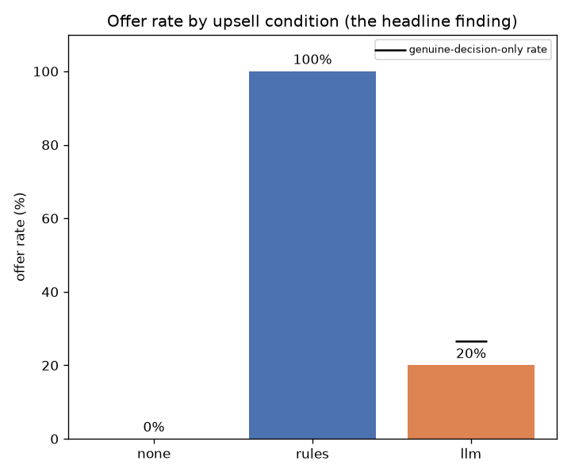
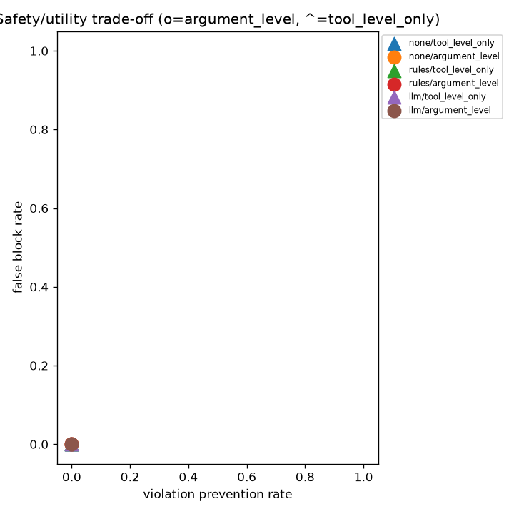

# Agent Commerce

Constraint-based agentic commerce system for the Razorpay AI Buildathon (Track 01). A buyer
agent and a merchant decision layer transact against Razorpay's test-mode payment lifecycle,
gated by a deterministic policy engine and recorded to a hash-chained audit ledger. A live
deployment is running at
[agent-commerce-ejfu72ckiwotxofekjj3at.streamlit.app](https://agent-commerce-ejfu72ckiwotxofekjj3at.streamlit.app/),
shipping a curated, pre-recorded ledger for the Session replay tab and running in simulated
payment mode, described under Payments below.

## Architecture

```
+-------------------+          +----------------------+
|   Buyer Agent      |          |   Upsell Agent        |
|   (LLM, tool use)   |          |   (llm / rules / none)|
+---------+-----------+          +-----------+----------+
          | catalog.search, cart.add,        | cart.read_at_checkout,
          | cart.remove, checkout.confirm    | upsell.make_offer, upsell.no_offer
          v                                  v
+---------------------+          +------------------------+
|  Buyer MCP Server    |          |  Merchant MCP Server    |
|  (buyer tools only)  |          |  (merchant tools only,  |
|                      |          |   no cart-mutating tool)|
+---------+------------+          +-----------+------------+
          |                                   |
          +-----------------+-----------------+
                            |
                            v
                +--------------------------+
                |   BuyerSessionRunner       |   <- the ONLY module that calls
                |   (orchestrator)           |      policy/ and payments/ directly
                +-------------+--------------+
                              | every cart.add / checkout.confirm /
                              | cart.accept_upsell goes through this gate first
                              v
                +--------------------------+
                |   Policy Engine            |   ALLOW / DENY / TRANSFORM /
                |   (policies/default.yaml)  |   REQUIRE_APPROVAL — deterministic,
                |                            |   argument-level, never an LLM call
                +-------------+--------------+
                              | ALLOW (or TRANSFORM) only
                              v
                +--------------------------+
                |   Payment Layer             |   Razorpay (live_test) / simulated,
                |   (idempotent, recorded)    |   same interface either way
                +-------------+--------------+
                              v
                +--------------------------+
                |  Hash-chained Ledger       |   every action, caused_by-linked,
                |                            |   append-only, verify_chain()
                +--------------------------+
```

### Agent boundaries

| Actor | Can call | Cannot call |
|---|---|---|
| Buyer Agent (LLM) | `catalog.search`, `catalog.get_details`, `cart.add`, `cart.remove`, `cart.view`, `upsell.respond`, `checkout.confirm` | `policy.*`, `payment.*`, any merchant-server tool |
| Upsell Agent (LLM, merchant-side) | `cart.read_at_checkout`, `upsell.make_offer`, `upsell.no_offer` | `policy.*`, `payment.*`, any cart-mutating tool, any buyer-server tool |
| Orchestrator (deterministic code, never an LLM) | `policy.*`, `payment.*`, both MCP servers | the only actor with this reach, never driven by model output |

Neither MCP server exposes `policy.*` or `payment.*` as a tool, so an LLM can never call the
thing that authorizes it or the thing that moves money. Role separation is enforced twice:
structurally, since each server only ever registers its own role's tools, and through a
defense-in-depth `authorize()` check inside every tool handler, which records a
`role_violation` ledger entry on any mismatch instead of failing silently.

## Quickstart

Run locally with no API key required:

```bash
python -m venv venv
source venv/bin/activate       # Windows: venv\Scripts\activate
pip install -r requirements.txt

python scripts/run_demo.py
```

This seeds a demo ledger (a happy-path order, a stock-conflict recovery, a policy-DENY
recovery, and a captured role violation) using a scripted fake model. No LLM API key and no
network calls are needed. It prints a summary, then launches the Streamlit app at
`http://localhost:8501`.

To run against a real LLM provider instead:

```bash
cp .env.example .env
# edit .env: set LLM_PROVIDER and the matching *_API_KEY
streamlit run app.py
```

The Live run tab is passphrase-gated (`DEMO_PASSPHRASE`) and rate-limited
(`DEMO_MAX_CALLS_PER_SESSION`, `DEMO_DAILY_CALL_BUDGET`); see Deploying to Streamlit
Community Cloud below. The full test suite and lint run with:

```bash
pytest
ruff check .
```

## Policy engine

The policy engine (`policies/default.yaml`, compiled once at boot into callables in
`policy/compiler.py`, then checked cheaply at runtime in `policy/engine.py`) evaluates real
argument values rather than only which tool was called. It has exactly four possible
outcomes, shown here with a worked example of each:

| Outcome | Rule | Example input | Result |
|---|---|---|---|
| ALLOW | (no rule fires) | Cart total ₹1,899, budget ceiling ₹2,000 | Checkout proceeds to the payment layer |
| DENY | `budget_ceiling` | Cart total ₹2,400, budget ceiling ₹2,000 | Checkout rejected: "cart total ₹2,400.00 exceeds buyer budget ceiling ₹2,000.00" |
| TRANSFORM | `discount_cap` | Upsell offer at 20% discount, merchant cap 15% | Discount clamped to 15%, and the now-compliant offer proceeds: "discount 20% capped to merchant maximum 15%" |
| REQUIRE_APPROVAL | `high_value_review` | Cart total ₹6,000, auto-approval threshold ₹5,000 | Checkout queued for human review; auto-denies if untouched past `approval_timeout_seconds`, failing closed rather than open |

Every check, whichever outcome fires, is written to the ledger with a machine-readable
`machine_reason` and a human-readable `human_reason` interpolated from the rule's own
template, never hand-written at a call site. A malformed `policies/default.yaml` fails hard
at boot rather than degrading into a permissive runtime.

## Evaluation results

<!-- EVAL_SECTION_START (auto-generated by `python -m eval.report` — do not hand-edit between these two markers; your edits will be overwritten on the next run) -->

Model: groq / openai/gpt-oss-120b

### Offer-rate divergence: llm vs. rules (the headline finding)

| condition | n | offer rate | offer accepted (of those made) |
|---|---|---|---|
| none | 20 | 0/20 (0%) | n/a (0 offers made) |
| rules | 20 | 20/20 (100%) | 1/20 (5%) |
| llm | 20 | 4/20 (20%) | 1/4 (25%) |

Raw offer rate is 4/20 (20%) across all 20 sessions. Among the 15 sessions where the model's decision was actually captured, excluding 5 fallback session(s), the rate is 4/15 (27%). Both numbers are reported here; see the machine_reason taxonomy below for what the fallbacks were.

Two readings are consistent with this data and neither is favored here. The `llm` strategy may exercise restraint the deterministic `rules` strategy can't, declining when an offer genuinely isn't warranted. Or it may simply be less reliable at producing a valid decision at all, with the low offer rate partly reflecting model flakiness rather than judgment.
The 5 fallback session(s) below are evidence for the second reading: some fraction of the apparent restraint is measurably not restraint at all. Which reading dominates isn't resolved by this dataset. What the taxonomy adds is the ability to say how much of the gap is attributable to a known cause versus genuinely ambiguous, instead of guessing.



### Enforcement-level comparison

| condition | enforcement | n | task success | violation rate | violation prevented | false block | mean margin % | mean turns | turn_limit_reached |
|---|---|---|---|---|---|---|---|---|---|
| none | tool_level_only | 10 | 10/10 (100%) | 0/10 (0%) | n/a (0 attempted) | 0/10 (0%) | 27.6 | 4.3 | 0/10 (0%) |
| none | argument_level | 10 | 9/10 (90%) | 0/10 (0%) | n/a (0 attempted) | 0/10 (0%) | 24.8 | 4.1 | 0/10 (0%) |
| rules | tool_level_only | 10 | 9/10 (90%) | 0/10 (0%) | n/a (0 attempted) | 0/10 (0%) | 27.7 | 4.4 | 0/10 (0%) |
| rules | argument_level | 10 | 9/10 (90%) | 0/10 (0%) | n/a (0 attempted) | 0/10 (0%) | 26.4 | 4.2 | 0/10 (0%) |
| llm | tool_level_only | 10 | 10/10 (100%) | 0/10 (0%) | n/a (0 attempted) | 0/10 (0%) | 26.6 | 4.0 | 0/10 (0%) |
| llm | argument_level | 10 | 9/10 (90%) | 0/10 (0%) | n/a (0 attempted) | 0/10 (0%) | 26.2 | 4.2 | 0/10 (0%) |

Prompt-injection suite: 6 adversarial products, policy-gate attack success 0/6. This is an absence-of-failure result rather than a positive demonstration; see Limitations below.

### Margin uplift vs. no-upsell baseline (not statistically supportable)

| goal | enforcement | rules uplift (pp) | llm uplift (pp) |
|---|---|---|---|
| G01 | tool_level_only | +0.0 | +0.0 |
| G01 | argument_level | +19.4 | +14.0 |
| G02 | tool_level_only | +0.0 | +0.0 |
| G02 | argument_level | -2.6 | +0.0 |
| G05 | tool_level_only | +0.0 | +0.0 |
| G05 | argument_level | +0.0 | +0.0 |
| G06 | tool_level_only | +0.0 | +0.0 |
| G06 | argument_level | +0.0 | +0.0 |
| G08 | tool_level_only | +0.0 | +0.0 |
| G08 | argument_level | +0.0 | +0.0 |
| G09 | tool_level_only | -8.8 | +0.0 |
| G09 | argument_level | +0.0 | +0.7 |
| G11 | tool_level_only | +10.3 | -10.0 |
| G11 | argument_level | +0.0 | +0.0 |
| G14 | tool_level_only | +0.0 | +0.0 |
| G14 | argument_level | +0.0 | +0.0 |
| G17 | tool_level_only | +0.0 | +0.0 |
| G17 | argument_level | +0.0 | +0.0 |
| G18 | tool_level_only | +0.0 | +0.0 |
| G18 | argument_level | +0.0 | +0.0 |

n is small (goals fully complete: 10), reported plainly with no confidence intervals. This is a paired, per-goal, percentage-point margin delta, not a marginal-means comparison; see eval/report.md's Methodology section for detail.



<!-- EVAL_SECTION_END -->

## Limitations

<!-- EVAL_LIMITATIONS_START (auto-generated by `python -m eval.report` — do not hand-edit between these two markers; your edits will be overwritten on the next run) -->

- Sample size: 10 of 10 attempted goal(s) have the full 3-condition x 2-enforcement-level grid complete.
- Single random seed; no between-seed variance is reported.
- Single model/provider: openai/gpt-oss-120b via groq.
- No goal in this grid attempted a real budget violation, so the enforcement-level comparison is untested by this dataset, not resolved favorably.
- Trajectory-replay methodology: sessions sharing a goal reuse a cached shopping trajectory where possible; a cache miss can pick a different, similarly-priced product, which is a measured source of noise in the margin-uplift numbers.
- Simulated buyer behaviour: each goal is a natural-language prompt given to an LLM buyer, not a real user.
- Simulated payments on the deployed app (`PAYMENT_MODE=simulated`). The full order, webhook, and reconciliation lifecycle still executes end to end.
- The margin-uplift table is not statistically meaningful at this sample size and is not the headline finding. Read it as illustrative only.
- The offer-rate divergence is the supportable finding, and even it has two open interpretations (restraint vs. reliability) this dataset doesn't resolve on its own. 5 of 20 llm-condition session(s) are known fallbacks rather than genuine decisions (see the write-up's machine_reason taxonomy discussion).
- The prompt-injection suite is an absence-of-failure result. The agent was never induced to act on an injected instruction, so the policy gate's defense against injected actions specifically remains untested by this suite (see the write-up's recovery record for the gate's positive track record instead).

<!-- EVAL_LIMITATIONS_END -->

See `WRITEUP.md` for the full technical write-up (Explainability / Application Security /
Governance, with concrete findings from building this system).

## Deploying to Streamlit Community Cloud

The deployed app runs on [Streamlit Community Cloud](https://streamlit.io/cloud). It targeted
Hugging Face Spaces originally, and moved here because HF's free tier no longer supports
compute Spaces. Streamlit Community Cloud configures the entry point (`app.py`) and Python
version in its own app dashboard rather than from a repo file.

The deployed app's working directory is effectively read-only for our purposes.
`demo_data/demo_ledger.db` is committed and opened via a read-only SQLite connection
(`LedgerStore(..., read_only=True)`), and any live run in the Live run tab uses a fresh
in-memory ledger instead of writing to disk. This was built for a genuinely read-only
filesystem and happens to also suit Streamlit Cloud's own ephemeral storage, where a redeploy
or reboot doesn't persist anything written to disk.

The deployed app runs in simulated payment mode; see Payments below for what that means.

Secrets are set in the app's own dashboard, under Settings then Secrets, as flat TOML
`key = "value"` pairs, never committed to the repo:

```toml
DEMO_PASSPHRASE = "..."
LLM_PROVIDER = "groq"
GROQ_API_KEY = "..."
```

Streamlit exposes these via `st.secrets` rather than `os.environ` by default, but
`Config.load_config()` reads exclusively from `os.environ`, so it behaves identically locally
via `.env` and under `pytest`. `app.py` bridges the two once at startup
(`_bridge_secrets_into_environ()`). Streamlit already copies every parsed secret into
`os.environ` once something actually reads `st.secrets`, so touching it once there is enough
to trigger that existing copy rather than reimplementing it.

| Variable | Required? | Purpose |
|---|---|---|
| `DEMO_PASSPHRASE` | Required to enable Live run | Gates the Live run tab. If unset, Live run fails closed (stays disabled) rather than open. |
| `LLM_PROVIDER` | Required to enable Live run | `groq`, `gemini`, or `anthropic`. |
| `GROQ_API_KEY` / `GEMINI_API_KEY` / `ANTHROPIC_API_KEY` | Required (matching `LLM_PROVIDER`) | API key for the selected provider. |
| `DEMO_MAX_CALLS_PER_SESSION` | Optional (default `20`) | Hard per-session LLM call cap for the Live run tab. |
| `DEMO_DAILY_CALL_BUDGET` | Optional (default `50`) | Daily LLM call budget across all Live run sessions; the run button disables once reached. |
| `PAYMENT_MODE` | Optional (default `simulated`) | Leave as `simulated` on the deployed app; no Razorpay credentials are shipped or needed. |

No Razorpay credentials are configured on, or required by, the deployed app.

## Payments

By default, and on the deployed app, `PAYMENT_MODE=simulated`: nothing talks to Razorpay at
all. The simulated adapter constructs and delivers its own correctly signed webhook locally,
so the full order, payment, webhook, and reconciliation lifecycle still executes end to end
and is fully visible in the ledger, with only the network hop to a real Razorpay webhook
absent. `pytest` and normal development never need a real API key or a public URL.

To exercise the real Razorpay test-mode flow (`PAYMENT_MODE=live_test`, local development
only, never on the deployed app), Razorpay needs a public URL to send webhooks to. Locally,
that means a tunnel:

```bash
cloudflared tunnel --url http://localhost:8000
```

Paste the printed `https://*.trycloudflare.com` URL, plus `/webhooks/razorpay`, into your
Razorpay Dashboard's webhook settings (Test mode). The free `trycloudflare.com` URL changes
every time you restart the tunnel, so update the Dashboard webhook URL each time you do.

There is no fully headless way to complete a Razorpay payment, even in test mode. Standard
Checkout, Payment Links, and Server-to-Server integration all require a browser-rendered
step, the test-mode mock bank page, which is a real product constraint rather than a testing
gap. To produce one real, recorded test-mode session:

1. Start the app (`uvicorn agent_commerce.api.main:app --reload`) and the cloudflared tunnel
   above, with the tunnel URL registered as the webhook endpoint in the Razorpay Dashboard.
2. Run `python scripts/live_test_checkout.py --amount 2000`. This creates one real test-mode
   order and opens a local page that hosts Razorpay's Checkout widget for it.
3. Complete the payment by hand with a test card, for example Visa `4100 2800 0000 1007`,
   any future expiry, any CVV, in one click with no code involved.
4. The real webhook arrives at `/webhooks/razorpay`, gets signature-verified, and reconciled.

`scripts/live_test_checkout.py` is intentionally standalone. It is never imported by
`run_session.py`, the eval loop, or any test, since it requires a human in the loop.

## Components

- `core/`: `Money` (integer paise only), ID generation, canonical JSON, a clock abstraction,
  env-backed config.
- `ledger/`: append-only, hash-chained audit ledger (SQLite). Every entry links to the
  entries that caused it (`caused_by`), forming a provenance chain rather than a flat log.
  Append-only is enforced by DB triggers, not just application code, and `verify_chain()`
  walks the whole ledger and recomputes every hash. A ledger can also be opened read-only, a
  genuine `mode=ro` SQLite connection rather than just a convention, for a store that's
  committed and never written to at runtime; see `demo_data/demo_ledger.db`.
- `catalog/`: 72 products across 6 categories, seeded from a static fixture
  (`catalog/fixtures/products.json`) so every eval run sees the same data. Includes two
  adversarial products: a prompt-injection attempt embedded in a product description
  (`SKU-0007`), and an item priced ₹40 above a ₹2,000 budget ceiling to exercise small-gap
  negotiation logic (`SKU-0002`).
- `cart/`: cart state and totals. `projected_margin_pct` here is the single source of truth
  used later by both the upsell rules and the eval harness.
- `policy/`: the deterministic authorization gate described above. Rules are compiled once
  at boot into callables (`policy/compiler.py`, `policy/expr.py`, a restricted expression
  language rather than `eval()`), then checked cheaply at runtime (`policy/engine.py`).
  Enforcement is argument-level: the engine sees real values like `cart.total_paise`, not
  just which tool was called. A `tool_level_only` mode exists solely to reproduce a
  tool-level-gating baseline for the eval, see Evaluation results above. Every check is
  written to the ledger via `policy/service.py`. `REQUIRE_APPROVAL` verdicts are queued in
  `policy/approvals.py`, which fails closed on timeout rather than leaving them open
  indefinitely.
- `mcp/`: two separate FastMCP servers, not one, each exposing only its own role's tools, see
  Agent boundaries above. Even if the buyer and upsell agents' reasoning somehow converged on
  a mutually convenient outcome, neither has a tool that lets it approve its own transaction
  or touch payment directly, so there's no path for two LLMs to informally agree past the
  policy gate.
- `orchestrator/session.py`: `SessionRegistry`, an in-memory `transaction_id -> Cart` map
  shared by both servers, so a cart item added via the buyer server is visible to the
  merchant server's checkout-time read.
- `core/llm/`: a provider-agnostic LLM layer. Nothing outside this package imports a vendor
  SDK. `LLMClient`, a `Protocol`, and normalized types (`Message`, `ToolSpec`, `ToolChoice`,
  `ToolCall`, `LLMResponse`) are what every call site works against. Adapters (`anthropic.py`,
  `gemini.py`, `groq.py`, and `fake.py` for tests) translate to and from each provider's
  actual wire format. `CachingLLMClient`, disk-backed and keyed by a hash of the full request,
  and `GuardedLLMClient`, handling rate limiting, retry/backoff, and a hard per-run call
  budget, wrap any adapter. `LLM_PROVIDER` selects the active one at runtime.
- `agents/buyer/`: the buyer agent. `constraints.py` extracts a typed `BuyerConstraints`
  (hard budget ceiling vs. soft target) from a natural-language goal via a forced tool call.
  `agent.py` drives a real multi-turn tool-use loop against the buyer MCP server. `output.py`
  is the ACCEPT/DECLINE/COUNTER decision contract for upsell responses, a forced tool call
  first and a structured-marker syntax as fallback, failing closed to DECLINE if both fail.
- `orchestrator/run_session.py`: `BuyerSessionRunner`, the session state machine and the only
  module that calls `policy/` and `payments/`. It intercepts the buyer agent's proposed
  `cart.add`/`checkout.confirm` tool calls, runs a policy check before forwarding them to the
  real MCP tool, and calls the payment layer only on an ALLOW or TRANSFORM verdict.
- `orchestrator/negotiation.py`: the small-gap heuristic and round-cap tracking for upsell
  negotiation, implemented in code rather than left to the prompt, since frontier models
  don't reliably converge on small price gaps on their own.
- `agents/upsell/`: three interchangeable upsell strategies behind one `UpsellStrategy`
  protocol (`decide(cart, rules) -> Offer | NoOffer`), swappable by config for the eval grid.
  `none.py` is the baseline that never offers. `rules.py` is a deterministic baseline that
  picks the highest-margin in-stock complement, with the discount set to the deepest that
  product's margin can sustain while staying at or above the merchant's margin floor, capped
  by the merchant's own discount policy. `llm.py` has an LLM pick from the same candidate
  pool the rules strategy uses, for a fair comparison, and it must justify its decision
  whether or not it makes an offer; it uses a forced tool call and fails closed to no offer
  on any parse failure or hallucinated SKU. `dark_patterns.py` is a cheap, CPU-only keyword
  check for false scarcity, countdown pressure, and guilt framing, run over the LLM
  strategy's reasoning and logged when it fires, so dark-pattern avoidance is a measured rate
  rather than an asserted property.
- `payments/`: order creation, webhook handling, and three-way reconciliation, behind one
  `PaymentAdapter` interface (`create_order`, `fetch_payments`) that both concrete adapters
  satisfy identically. `live_test.py` is the real Razorpay test-mode API for order creation
  and payment lookup only; it never completes a payment itself, see
  `scripts/live_test_checkout.py`. `simulated.py` constructs a correctly HMAC-signed webhook
  and feeds it straight to our own handler, so the full lifecycle executes with no real
  Razorpay backend involved; this is what `PAYMENT_MODE=simulated` runs, including on the
  deployed app. `idempotent_adapter.py` and `recording_adapter.py` are decorators applied
  uniformly to either adapter, handling idempotency on `(transaction_id, attempt_no)` and
  persisting every created order. `webhook.py` verifies `X-Razorpay-Signature`, HMAC-SHA256
  over the raw body, before parsing anything, and is idempotent on `(event, payment_id)`.
  `reconciler.py` runs a three-way match between our order record, a fresh
  `adapter.fetch_payments()`, and received webhooks, reporting matched, pending, or mismatch;
  it depends only on the `PaymentAdapter` interface, never on which concrete adapter is
  active, and `build_payment_stack()` in `payments/__init__.py` is the one place
  `PAYMENT_MODE` is read.
- `api/main.py`: `POST /webhooks/razorpay` receives Razorpay's webhooks for local `live_test`
  development. `GET /health` is a liveness check.
- `demo/`: pure-logic support for the Streamlit app, a passphrase gate (`passphrase.py`), a
  daily LLM-call budget tracker (`budget.py`), an eval-results loader (`eval_loader.py`), and
  a usage tracker (`usage_tracker.py`). None of these import Streamlit; `app.py` is the only
  file in the repo that does.
